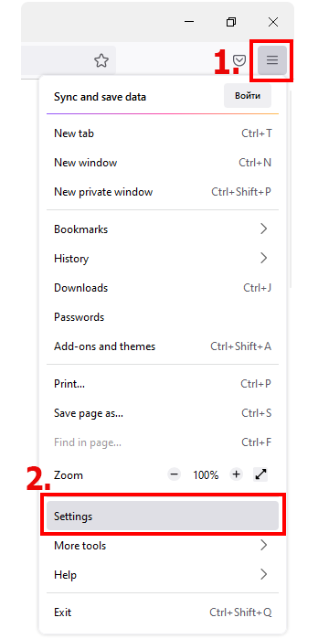
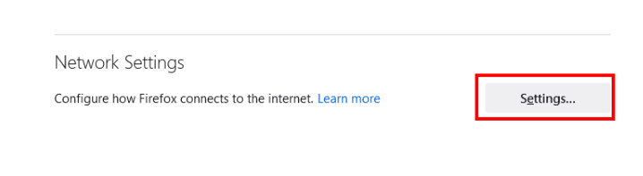
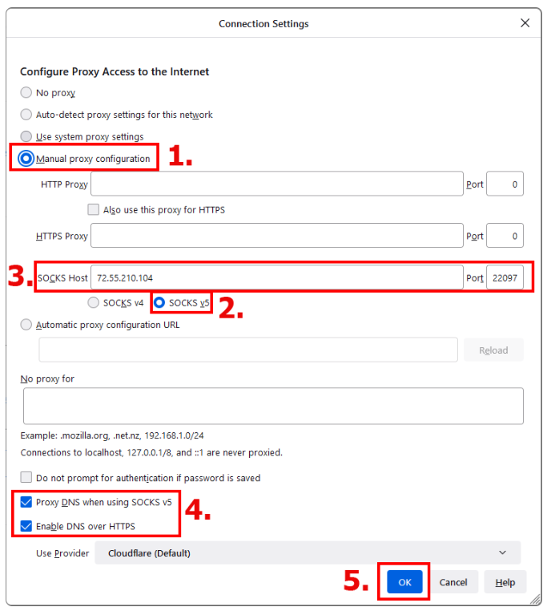
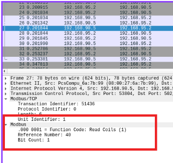

:siemip: 192.168.90.20
:attackerip: 192.168.0.249
= OT ISAC Training

This repository contains the links, and code necessary for the OT SOC Detection Engineering Workshop.

== Environment

* Chemical Plant Simulation : http://192.168.95.10
* PLC : http://192.168.95.2:8080
* HMI : http://192.168.5:8080/ScadaBR
* Firewall : http://192.168.90.100
* Workstation : 192.168.95.200

=== Credentials

PLC : user : password
HMI : admin : admin
Firewall : admin : pfsense
Workstation : workstation : Fortphyd
SIEM : blueteam : BlueIceFox@1


== Exercise 1 - Login to Chemical Plant simulation

=== Step 1
Port forward through Jump server

`ssh -D 8080 kali@{attackerip}`

`pass : kali`

=== Step 2

Configure your browser for using a Dynamic Socks 5 Proxy. It's better to create a new profile, open that in a new window and use the proxy on the new profile. This will enable you to use your unproxied browser for doing research and browsing the internet, while using your proxied browser to manage the OT simulation ecosystem. 

.Open the menu and select settings


.Scroll all the way to the bottom and open Network Settings


You should enter the following details into the fileds below

```
SOCKS5 HOST : 127.0.0.1
PORT : 8080 (or whatever port you used after the -D flag in your ssh command)
Dont bother with the DNS settings in 4 below.
```

.Enter the proxy details in the above fields



=== Step 3 - Open the simulation

Open your browser (the one with the proxy setting) and head to

Chemical Plant Sim : http://192.168.95.10

HMI : http://192.168.5:8080/ScadaBR

HMI Creds - `admin : admin`

=== Step 4 - Switch off and on the plant

Use the HMI to switch off and on the plant. Observe what happens to the simulation.

== Exercise 2 - Log in to the attacker machine

`ssh kali@{attackerip}`

`pass : kali`

== Attack 1 - ARP Spoofing and traffic sniffing

*Do not do this in a shared lab* as it will spoil the activity for your fellow participants. Ordinarily, as an attacker, you can spoof the HMI using `arpspoof 192.168.90.5` from your attacker machine, and then run wireshark on the interface connected to that network. You should see the modbus commands going between the PLC and HMI. 

Inspecting this traffic will help you to understand which coil to change to shutdown the plant. (It's coil 40)

.Coil 40 Bit 1 shutds down plant



== Attack 2 - Modbus command injection

Flip the bit in Coil 40. Use the python script provided to do this. In the attacker machine go to `~/Documents/working_files`. Activate the python env using `source venv/bin/activate` and run the python file

[,python]
----
include::working_files/shutdown_plant.py[]
----

This should have the same result as clicking on the HMI

== Attack 3 - Malicious PLC program upload

Turn the plant back on and make sure the simulation is running. Now we are going to upload a malicious PLC program to cause the plant to explode. Use the `attack.st` file to upload your malicious program to the PLC. Use the PLC's web interface on `http://192.168.95.2:8080` for this.

If you want to understand this PLC program in detail, you should install the OpenPLC editor. https://autonomylogic.com/download/ 

Grab the PLC programs from the original GRFICSv2 repo and play with them.

When you're done blowing up the plant, you should put the `simpl.st` file back on the PLC.

== Attack 4 - Overwrite Pressure Setpoint with modbus injection

You can achieve a similar result to the malicious PLC program upload (unsafe state) by over writing a safe pressure setpoint register. If you download the GRFICSv2 workstation VM, open the OpenPLC editor, and view the initial setpoints of the PLC program, it becomes clear that there are two registers (exposed on 1025 and 1026) that contain values that can be overwritten to put the plant in an unsafe state.

You may try this from the below code

[,python]
----
include::working_files/blow_up_plant.py[]
----

== Defense

=== Detection logic

Below is a snippet of the detection logic in Wazuh for PLC file integrity, a custom PLC probe for the pressure setpoint, and for network access to the PLC from unauthorized machines.

[,xml]
----
<!-- Local rules -->

<!-- Modify it at your will (and your own risk). -->
<!-- Copyleft RUDRA Cybersecurity -->
<!-- Example -->
<group name="local,">

  <!--
  Dec 10 01:02:02 host sshd[1234]: Failed none for root from 1.1.1.1 port 1066 ssh2
  -->
  <rule id="100001" level="5">
    <if_sid>5716</if_sid>
    <srcip>1.1.1.1</srcip>
    <description>sshd: authentication failed from IP 1.1.1.1.</description>
    <group>authentication_failed,pci_dss_10.2.4,pci_dss_10.2.5,</group>
  </rule>

  <rule id="100002" level="0">
    <location>/var/log/output.log</location>
    <field name="value">\.+</field>
    <description>PLC values grouped $(value)</description>
    <group>plc,</group>
  </rule>
  <rule id="100003" level="13">
    <if_sid>100002</if_sid>
    <field name="value" type="pcre2">^(55[3-9]\d{2}|5[6-9]\d{3}|[6-9]\d{4}|\d{6,})</field>
    <description>Urgent:: PLC pressure setpoint $(value)</description>
    <group>plc,</group>
  </rule>
  <rule id="100005" level="10">
    <if_group>syscheck</if_group>
    <field name="file">/home/user/OpenPLC_v2/st_files</field>
    <description>PLC programme integrity alert</description>
    <group>plc,syscheck,</group>
  </rule>  
  <rule id="100010" level="13">
    <if_sid>86601</if_sid>
    <field name="src_ip">192.168.95.2</field>
    <field name="dest_ip" negate="yes">192.168.90.5|192.168.90.200</field>
    <description>Urgent:: Suricata PLC communicating with unknown IP $(dest_ip)</description>
    <group>plc,suricata,</group>
  </rule>
  <rule id="100023" level="0">
    <if_sid>510</if_sid>
    <field name="file">bin/diff$</field>
    <description>False-positive match for rootcheck regex</description>
    <group>syscheck,rootcheck,</group>
  </rule>  
</group>
----

== Credits

The GRFICSv2 simulation is by Fortiphyd - https://github.com/Fortiphyd/GRFICSv2 

== Further reading

https://www.usenix.org/system/files/conference/ase18/ase18-paper_formby.pdf

The above whitepaper lists out all the possible attacks on the GRFICSv2 testbed.

== Open source security tooling used

* Suricata - https://suricata.io/
* Zeek (Bro) - https://zeek.org/
* Wazuh - https://wazuh.com/
* OpenvSwitch - https://www.openvswitch.org/
* PfSense - https://www.pfsense.org/
* OpenPLC Editor - https://autonomylogic.com/download/
* OpenPLC Runtime - https://autonomylogic.com/ 
* ScadaBR - https://sourceforge.net/projects/scadabr/
* Caldera - OT : https://github.com/mitre/caldera-ot
